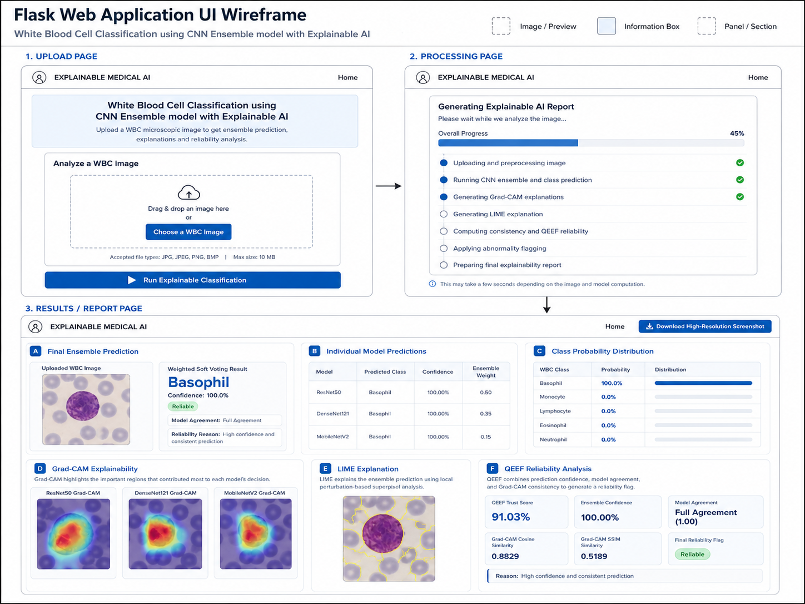

# White Blood Cell Classification using CNN Ensemble Architecture: ResNet50, DenseNet121, MobileNetV2

Flask-based medical imaging web application for **White Blood Cell (WBC) classification** using a **CNN ensemble** with **Grad-CAM**, **LIME**, and a **QEEF-style reliability analysis**.



## Overview

This project lets a user upload a microscopic WBC image and receive:

- Final ensemble prediction across 5 WBC classes
- Individual predictions from ResNet50, DenseNet121, and MobileNetV2
- Grad-CAM visual explanations for each CNN
- LIME explanation for the ensemble prediction
- Reliability analysis based on confidence, agreement, and explanation consistency
- Downloadable high-resolution result screenshot

## Supported Classes

- Basophil
- Eosinophil
- Lymphocyte
- Monocyte
- Neutrophil

## UI Flow

1. Upload a WBC microscopic image from the home page.
2. Watch the real-time processing progress.
3. Review the final report with prediction, class probability distribution, Grad-CAM, LIME, and reliability metrics.
4. Download the generated result screenshot if needed.

## Tech Stack

- Flask
- TensorFlow / Keras
- OpenCV
- NumPy
- scikit-image
- scikit-learn
- Matplotlib
- LIME

## Project Structure

```text
WBC_Flask_App/
|-- app.py
|-- requirements.txt
|-- models/
|-- templates/
|-- static/
|   `-- vendor/
`-- docs/
    `-- ui-wireframe.png
```

## Run Locally

Recommended: **Python 3.11**

### 1. Clone the repository

```powershell
git clone <your-repo-url>
cd WBC_Flask_App
```

### 2. Create and activate a virtual environment

```powershell
python -m venv .venv
.\.venv\Scripts\Activate.ps1
```

If PowerShell blocks activation:

```powershell
Set-ExecutionPolicy -Scope Process Bypass
.\.venv\Scripts\Activate.ps1
```

### 3. Install dependencies

```powershell
python -m pip install --upgrade pip setuptools wheel
pip install -r requirements.txt
```

### 4. Add trained model files

Place these files inside the root `models/` folder:

- `resnet50_wbc_final.keras`
- `densenet121_wbc_retuned_final.keras`
- `mobilenetv2_wbc_retune_v3_final.keras`

### 5. Start the Flask server

```powershell
python app.py
```

### 6. Open in browser

```text
http://127.0.0.1:5000
```

## Model Files

The application first looks for model weights in `models/`.

You can also override model locations with these environment variables:

- `RESNET_MODEL_PATH`
- `DENSENET_MODEL_PATH`
- `MOBILENET_MODEL_PATH`

Important: the trained `.keras` weight files are not committed to the GitHub repository because they exceed standard GitHub file size limits.

## Accepted Input

- File types: `JPG`, `JPEG`, `PNG`, `BMP`
- Maximum file size: `10 MB`

## Notes

- First-time dependency installation may take longer because of TensorFlow.
- Generated uploads and explanation images are runtime artifacts and are not meant to be committed.
- This project is suitable for research, demo, and academic presentation workflows.

## License

This project is licensed under the [MIT License](LICENSE).
